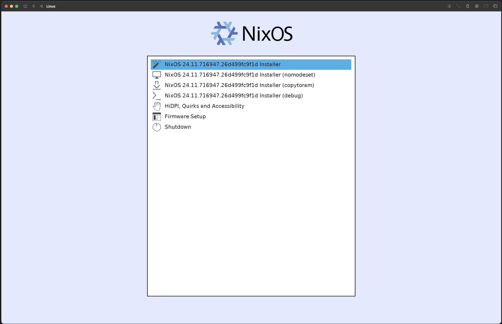
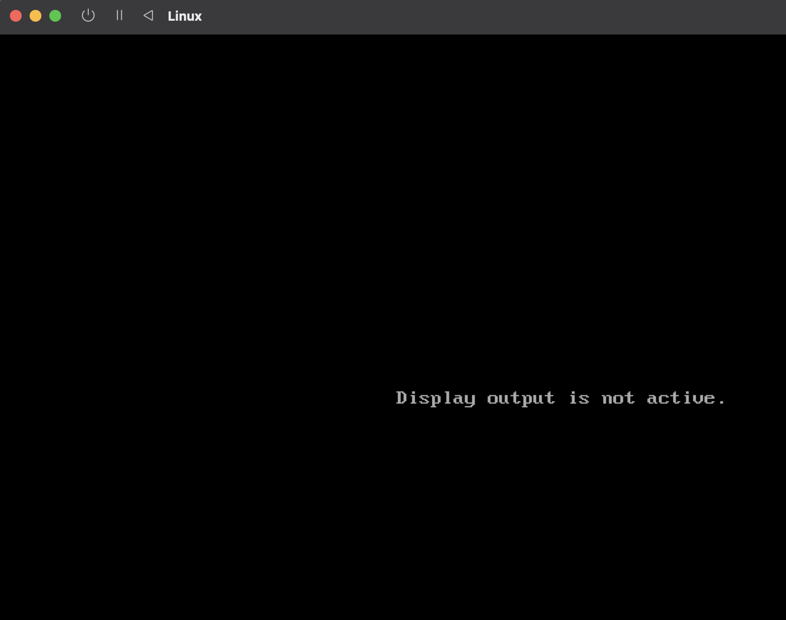
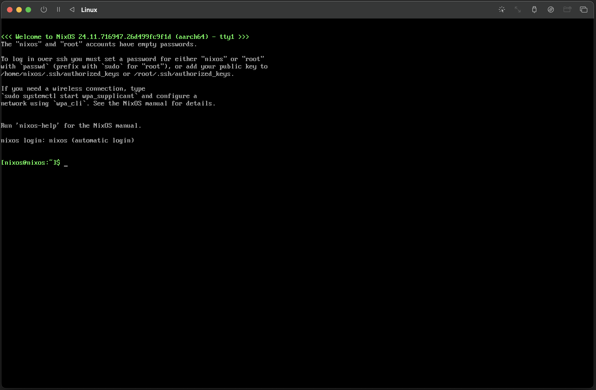

Trustless software development and reproducible builds are at the heart of Bitcoin's ethos, and Guix is the key to making this a reality.

Setting up a reproducible Bitcoin Core build environment using Guix on a Mac can be a hassle due to its dependency on a Linux base. In this blog series, I'll show you a simple solution: running Guix on a NixOS (within a virtual machine). This article will show how to use my NixOS flake to set up a NixOS environment for Guix reproducible builds.

<!--more-->

<span class="continue" id="continue-reading"></span>

## Booting into NixOS installer

Once the VM is correctly set up, start the VM and boot from the NixOS installer.

To do this, you need to download the NixOS ISO image from the official NixOS website. You can find the latest version of the NixOS ISO image here: [NixOS Download](https://nixos.org/download.html). Make sure to select the minimal ISO and appropriate architecture (x86_64 or aarch64) based on your VM configuration.

After booting, you will be presented with the NixOS installer screen.


<span class="image-caption">NixOS installer screen</span>

Select the first option to start the installation process. NixOS will boot into a live environment. In UTM, you might see a warning about "no display" or "no graphics". This is normal and expected. The screen should return to normal after a few minutes. If you see a black screen for an extended period, you can try restarting the VM.


<span class="image-caption">UTM warning screen</span>

Once the installer is started, you'll be logged in as the default user in a command-line interface, where you can configure and install NixOS.


<span class="image-caption">UTM nixos terminal</span>

The default user does not have sufficient permissions to perform the installation. To proceed, start an interactive root shell with the full root environment by running the following command:

```bash
$ sudo -i
```

Now we are ready to start the installation!

## Partitioning the disk

Next, you'll need to partition the disk. This NixOS installation uses a flake-based configuration designed for a UEFI BIOS, which is the default in UTM. The following partitioning commands reflect this setup.


In the live environment, you can use the `lsblk` command to list the available disks and partitions. If you use UTM you would should see a disk named `/dev/vda`, which is the virtual disk created by UTM. If you would use something else the disk you will see depends on your config.


To partition the disk, use the `parted` command:

```bash
$ parted /dev/vda -- mklabel gpt
$ parted /dev/vda -- mkpart primary 512MB 100%
$ parted /dev/vda -- mkpart ESP fat32 1MB 512MB
$ parted /dev/vda -- set 2 esp on
$ mkfs.ext4 -L nixos /dev/vda1
$ mkfs.fat -F 32 -n BOOT /dev/vda2
```


Do not change the labels of the partitions, these are used in the configuration to mount the partitions after install. If you want to rename the partitions do not forget to change the labels in the hardware-config.nix file


In this example, we create:

- GPT partition table on the disk `/dev/vda`
- primary partition for NixOS, and label it `nixos`
- primary partition for the EFI System Partition (ESP), and label it `BOOT`
- set the ESP partition as an EFI System Partition (ESP).
- format the NixOS partition as ext4 and the ESP as FAT32.


There is no swap partition created because swapping to ssd will shorten the lifespan of the ssd


After creating the partitions, you need to mount the created partitions:

```bash
$ mount /dev/disk/by-label/nixos /mnt
$ mkdir -p /mnt/boot
$ mount -o umask=077 /dev/disk/by-label/BOOT /mnt/boot
```


In this example, we mount the NixOS partition to `/mnt` and the ESP to `/mnt/boot`. This is only temporary for the install


## Flake clone

To configure NixOS for Guix, we first clone my flake repository, which contains the necessary configuration files. Since the NixOS installer environment lacks git, we'll start a nix-shell with git included to perform the cloning.

```bash
$ nix-shell -p git
```

Now we can clone the flake repository. To clone the flake repository, run the following command:

```bash
$ git clone https://github.com/janb84/GUIXonNixOS.git /mnt/etc/nixos
```

This command clones the flake repository into the `/mnt/etc/nixos` directory.

## Install NixOS

Now that we have the flake repository cloned, we can proceed with the NixOS installation. To do this, run the following command:

```bash
$ nixos-install --root /mnt --flake /mnt/etc/nixos#aarch64
```

This command installs NixOS using the configuration specified in the flake repository. The `aarch64` argument refers to a flake output attribute, typically defining the target architecture or system configuration. In this flake, 2 output attributes are specified; one for x86_64 systems (use `#x86_64`) and one for aarch64 systems (`#aarch64`).

After the installation is complete, you will be prompted to set a root password. Enter a secure password and confirm it. Once the installation is finished, you can unmount the partitions and reboot the system.

```bash
$ umount -R /mnt
```

After unmounting the partitions, you can reboot the system:

```bash
$ reboot
```

After rebooting, you should see the NixOS boot screen. Select the NixOS option to boot into your newly installed NixOS system.

## Post-installation

After booting into NixOS, you can log in as root using the password you set during the installation process.

Once logged in, you can start using NixOS with Guix. All you need to do is to clone the bitcoin repository and start building with Guix. The necessary packages are already set up to compile Bitcoin with Guix.


Due to licensing issues, the MacOS SDK is NOT included. Follow the steps in bitcoin repository to acquire it

