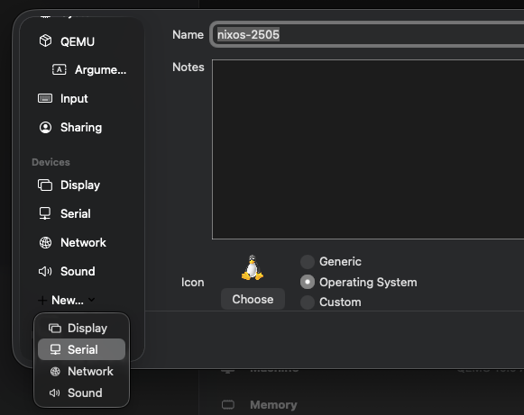

Sometimes you just want to copy and paste between the host machine and a UTM console.

Struggling to copy and paste from your host machine to a UTM terminal window? You're not alone, it's trickier than it sounds! In this short blog post, I will show you how to add a serial console to your UTM VM instance, enabling copy and paste.

<!--more-->

## Adding a serial console

Adding a serial console to a VM involves just a few steps:

- Open UTM and create a VM (or select an existing VM)
- Make sure that the VM is stopped and open the settings of the VM.
- Go to the "devices" section of the VM settings
- Press the "+New" button
- Select "Serial" (see figure 1)

figure 1: UTM VM settings screen

After adding the serial console, you can start the VM. While the VM is booting, a new terminal window will open, which is the serial console. In this window, you can interact with the VM's console just like in the UTM window. With one key difference: you can now easily copy and paste text between your host machine and the VM console!


You can still interact with the VM using the UTM window, but for copy and paste, use the serial console window.

