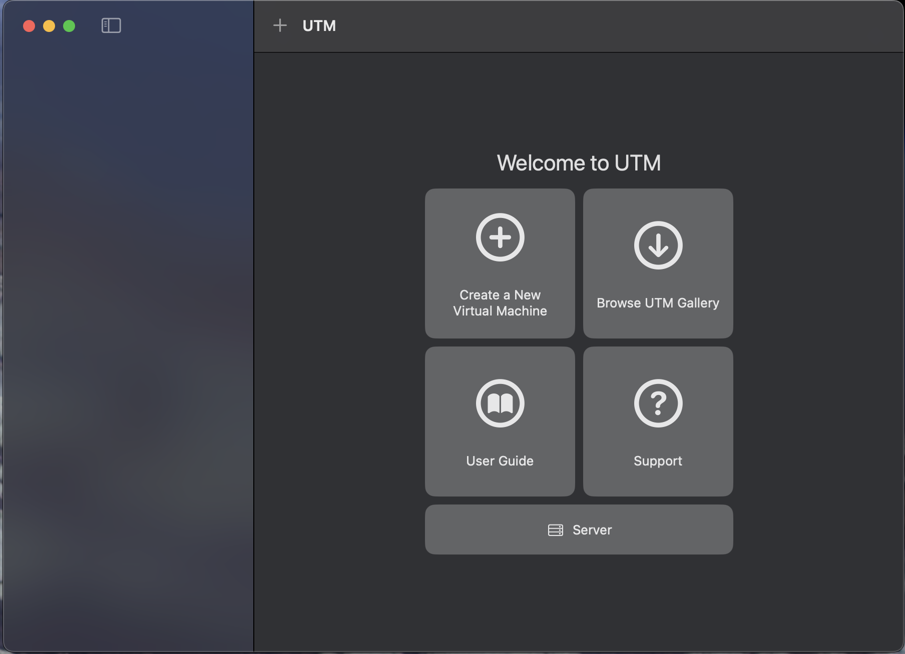
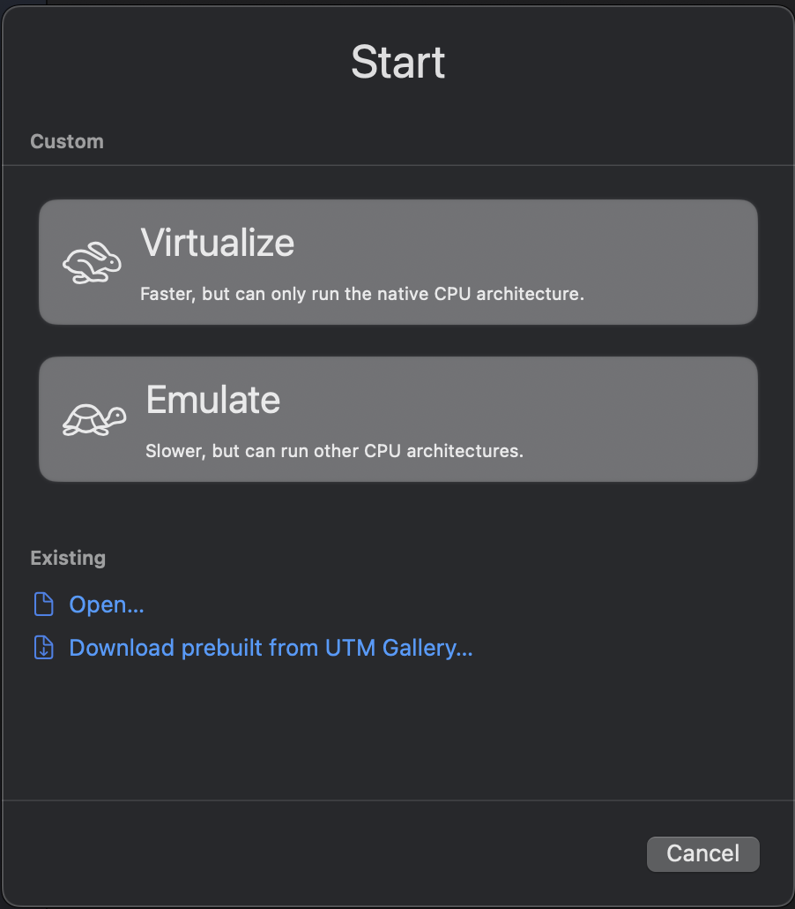
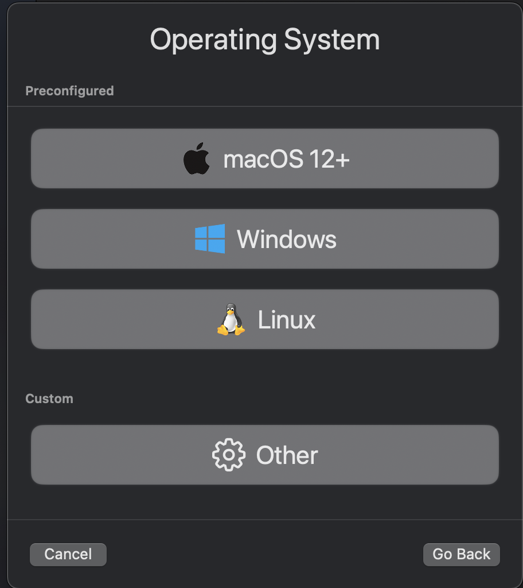
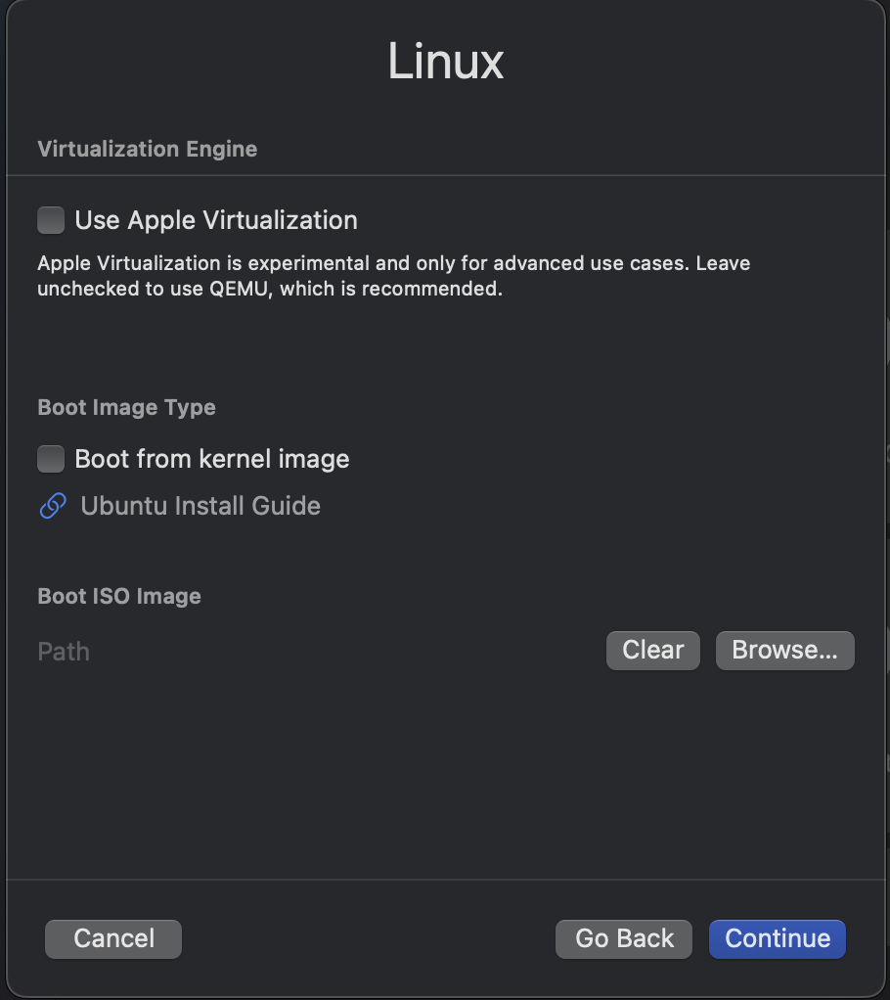
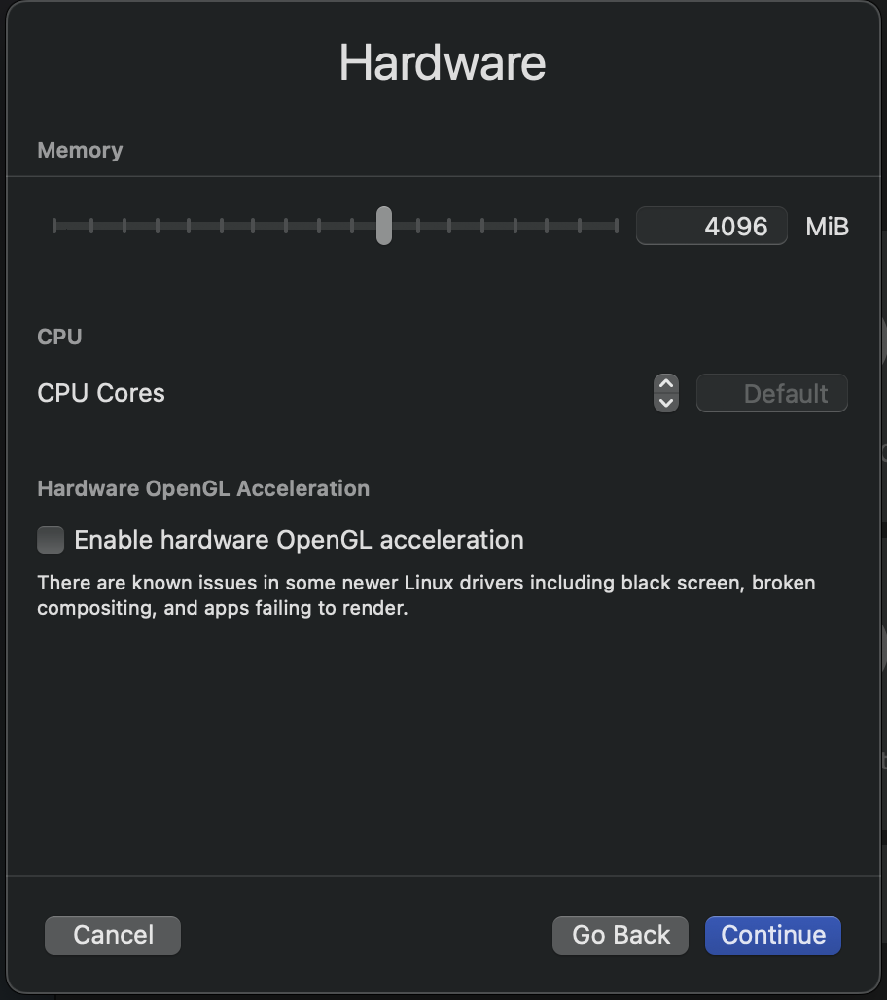
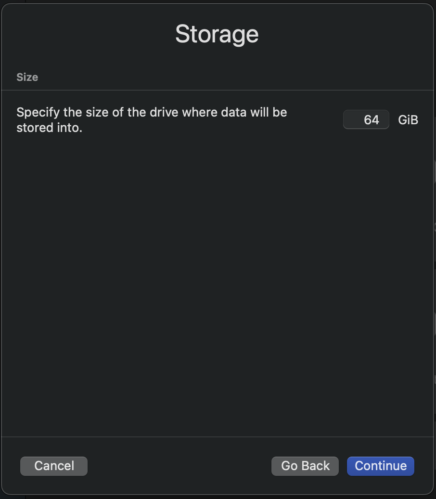
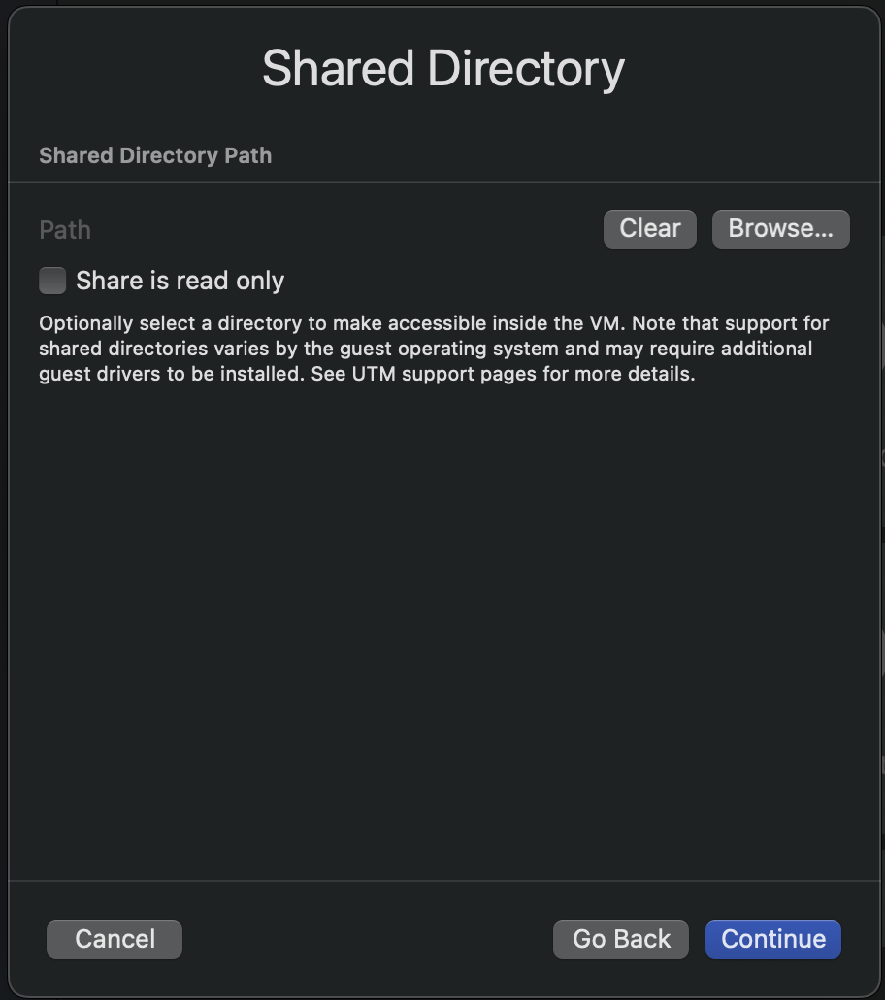
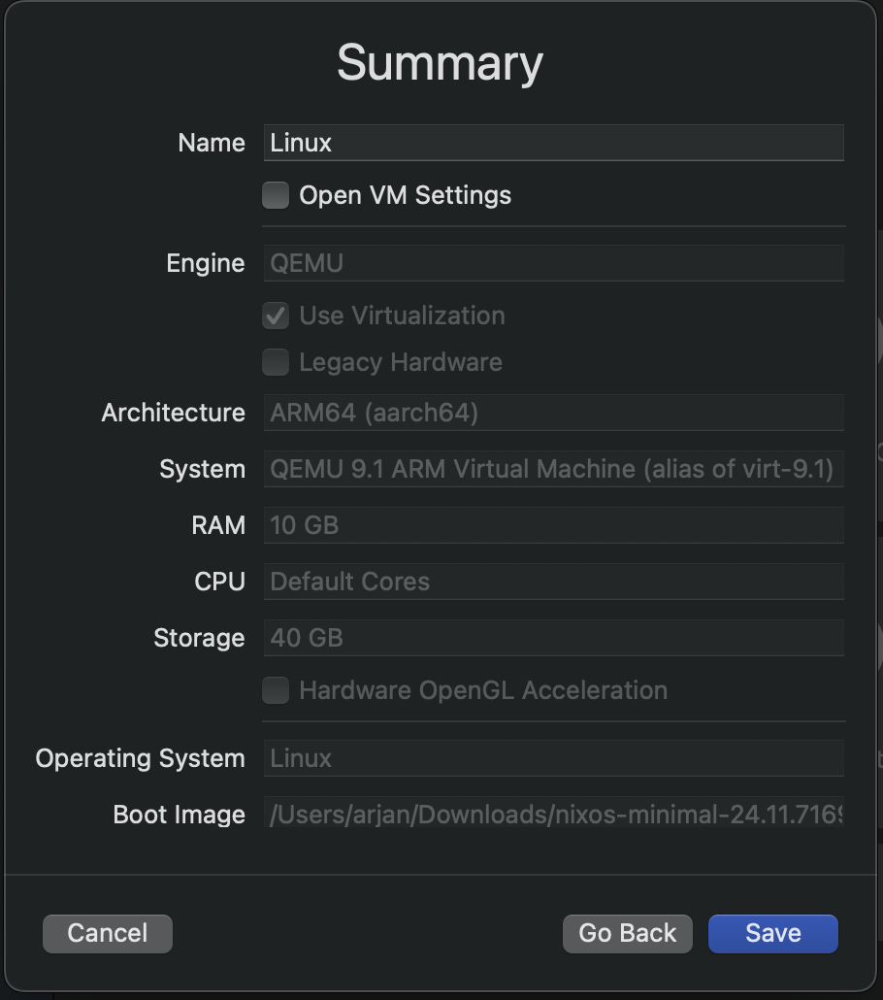

Setting up a reproducible Bitcoin Core build environment using Guix on a Mac can be a hassle due to its dependency on a Linux base. In this blog, I'll show you a simple (partial) solution: Setup a UTM to host a VM on which NixOS can be run.

<!--more-->

<span class="continue" id="continue-reading"></span>

## What is needed

To get started, you'll need a few things:

- A fresh copy of NixOS installer: [ARM](https://channels.nixos.org/nixos-24.11/latest-nixos-minimal-aarch64-linux.iso) or [x86-64](https://channels.nixos.org/nixos-24.11/latest-nixos-minimal-x86_64-linux.iso)
- Around 50GB of free space on a hard disk
- QEMU virtual machine host (see below)

Once you have these prerequisites, we can continue to set up UTM.

## UTM or not?

In this blog post, I'll be using UTM as my virtual machine host, a user-friendly QEMU-based option for macOS. While there are other ways to run QEMU-based containers, for this example, I'm using UTM for its native macOS integration and apple silicon support.

If you have Nix installed on your macOS system, running UTM is straightforward:

```bash
$ nix-shell -p utm
```

After Nix completes its setup, you can start UTM from the nix-shell by running `UTM`:

```bash
nix-shell$ utm
```

(Alternatively, you can launch UTM directly from the Applications folder if it's installed as an application.)

Upon launching UTM, you'll be greeted by its welcome screen.


<span class="image-caption">UTM welcome screen</span>

On this screen, several options are available. To create a new VM, click the `+ Create a New Virtual Machine` button. This will launch a wizard to guide you through configuring the VM.

Next, you will be presented with the first step in the VM creation wizard, where you can select the type of the VM.


<span class="image-caption">UTM wizard start screen</span>

In the first step, select the `Virtualize` option. This is important because it allows UTM to use QEMU's virtualization capabilities, which are essential for running NixOS efficiently.

In the next step, you are be prompted to select the operating system type.


<span class="image-caption">UTM wizard OS selection screen</span>

In this step, select the `Linux` option. This is important because NixOS is a Linux distribution, and selecting the correct type ensures that UTM configures the VM appropriately.

This step of the wizard gives the option to select some advanced options and the boot media.


<span class="image-caption">UTM wizard boot media</span>

In this step, you have to select the NixOS installer ISO image you downloaded earlier. This is the image that UTM will use to boot the VM and install NixOS.

After selecting the ISO image, you can configure the VM's hardware settings. First, set the amount of RAM.


<span class="image-caption">UTM wizard memory setting</span>

In this step, you can set the amount of RAM for the VM. For NixOS, I recommend at least 8GB of RAM, but you can adjust this based on your needs.

Next, you can configure the storage settings for the VM. This is where you specify the size of the virtual hard disk that will be used for NixOS (and GUIX).


<span class="image-caption">UTM wizard storage setting</span>

In this step, you can set the size of the virtual hard disk. The default setting is 64GB, which is a bit high. I recommend at least 50GB for NixOS and GUIX, but you can adjust this based on your needs.

After configuring the storage settings, you can set the shared directory.


<span class="image-caption">UTM wizard shared directory setting</span>

In this step, you can set the shared directory. This is the directory on your macOS host that will be shared with the VM. You can set this to any directory you want, but I have not been able to get it working under NixOS.

Next, the wizard shows a summary of the VM settings.


<span class="image-caption">UTM wizard summary screen</span>

In this step, you can review the settings for the VM. If everything looks good, click the `Save` button to create the VM.

After creating the VM, you will be taken to the main UTM window, where you can see the VM you just created. To start the VM, click the `Play` button.

## Final thoughts

Setting up a NixOS VM with UTM on Apple Silicon is a way to leverage the performance and efficiency of modern macOS hardware. UTM's seamless integration with Apple Silicon, through its QEMU-based virtualization, makes it a good option to experiment with NixOS and/or GUIX.

While some features, like shared directories, may not work perfectly with NixOS, the overall setup process is straightforward. One negative aspect of using nix to run UTM is that it creates a folder structure in the host system that may not be ideal for all users. The folder structure is created under `/Users/--user-- /Library/Containers /com.utmapp.UTM/Data` which can be a bit messy.

For the next steps, refer to my blog post "GUIX on NixOS" to complete the installation and start exploring.
